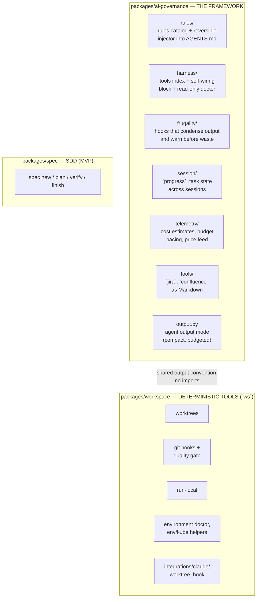
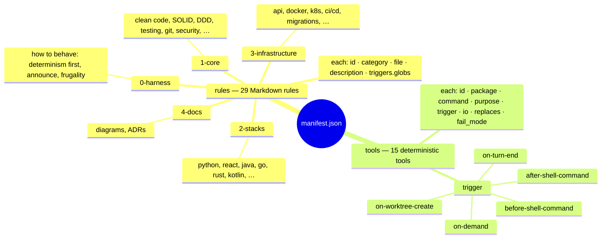
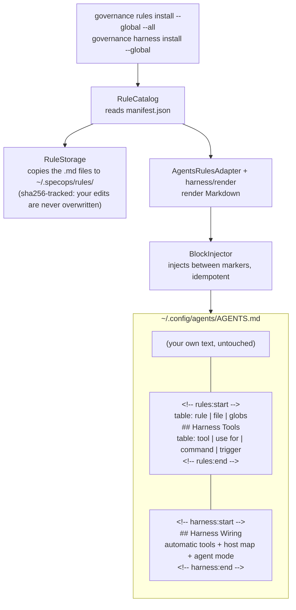
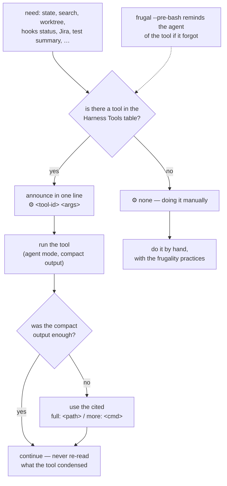
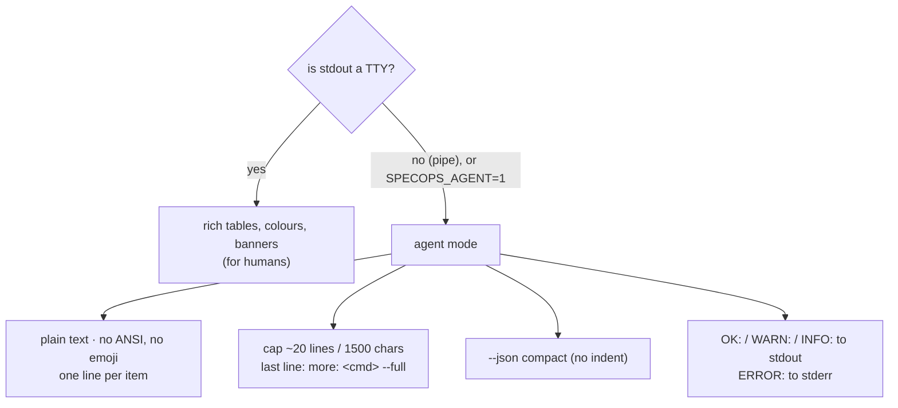
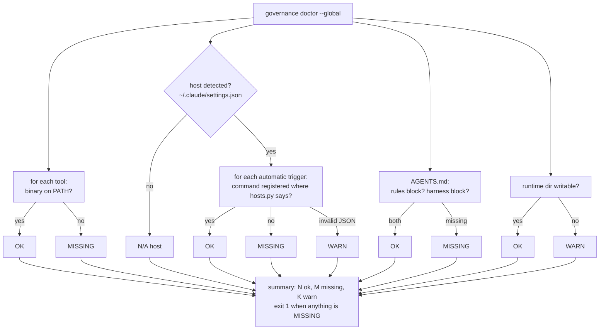
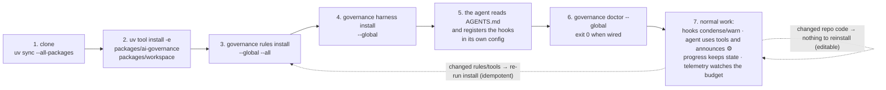

# ia-spec-ops-engine

A development framework for AI coding agents that is **agnostic to the agent**: a
catalog of engineering rules, a set of deterministic tools, and the glue that makes any
agent (Claude Code, Codex, Cursor, Aider, …) prefer those tools over reasoning — because
reasoning costs tokens and a tool costs none.

The repository is a source checkout with three independently installable Python
packages. It does not bootstrap, install, or configure anything by default.

| Package | Purpose | Installed only when explicitly requested |
| --- | --- | --- |
| `packages/ai-governance` | The framework: rules catalog, harness, context frugality, progress tracking, telemetry, Atlassian utilities | Yes |
| `packages/workspace` | Deterministic low-level tools (`ws`): Git worktrees, quality gates, local services, environment tools | Yes |
| `packages/spec` | Specification-driven workflows (MVP) | Yes |

Tell the coding agent which package and capability you want, e.g. "Use `ai-governance`
rules for Python and core practices in this repository" or "Install only the Workspace
Git-hook tooling." The agent must inspect the requested component and propose the exact
installation before making changes.

---

## 1. The idea in one sentence

What is deterministic runs as Python without an LLM (zero tokens, same result every
time). What is *behaviour* is written in a file the agent reads (`AGENTS.md`). What is
inherently tied to one host lives in a single, isolated adapter.

| Nature of the thing | Where it goes | Examples |
| --- | --- | --- |
| Runs every turn / would cost tokens if the LLM did it | Python code, no LLM | `frugal`, `progress`, `ws`, `telemetry`, `governance doctor` |
| Happens once / must adapt to each agent | Documentation the agent reads | harness wiring block, rule `00-deterministic-first` |
| Tied to one host by nature | One isolated adapter | `rules/core/hosts.py`, `ws hook claude-worktree-create` |

## 2. The three layers



`ai-governance` and `workspace` never import each other; each installs on its own.
They share a *convention* (the output contract in §8), not code.

## 3. One source of truth: `manifest.json`



Triggers use **agnostic names**. Nothing in the catalog mentions a specific agent. The
only file that knows "on Claude Code, `after-shell-command` lives in
`hooks.PostToolUse`" is `rules/core/hosts.py`, a lookup table. Another host is another
row, not more code.

## 4. Generating the harness (installation)



`AGENTS.md` is a cross-agent standard. Running `install` twice never duplicates a block
(the injector replaces what sits between the markers). `uninstall` removes only the block
and keeps your text. Use `--local --root <dir>` for a project-scoped `AGENTS.md`.

**There is no installer that writes agent config.** The `harness` block tells the agent:
"if your runtime supports event X, register this command there (see the host map); if it
doesn't, run the command manually at that point". The agent self-configures by reading.
`governance doctor` then verifies — read-only — whether it did.

## 5. What happens on every agent turn (runtime)

```mermaid
sequenceDiagram
    participant A as Agent
    participant H as Host runtime
    participant PRE as frugal --pre-bash
    participant SH as Shell
    participant POST as frugal --post-bash
    participant TEL as telemetry thresholds --notify
    participant WT as ws hook claude-worktree-create

    A->>H: run a shell command
    H->>PRE: before-shell-command {command}
    Note over PRE: wasteful command? (lockfile cat, git log without -n, …)<br/>a tool that replaces it? (built from `replaces`)<br/>warns once per session · never blocks
    PRE-->>H: additionalContext: "Deterministic alternative: `ws worktree …`<br/>Announce it as ⚙ ws-worktree"
    H->>SH: execute
    SH-->>H: stdout (possibly huge)
    H->>POST: after-shell-command {command, stdout}
    Note over POST: tests → result + failing block only<br/>listings → head + tail · git diff/show → exempt<br/>full output saved to disk, cited as `full: &lt;path&gt;`
    POST-->>H: condensed stdout
    H-->>A: what the agent actually reads
    H->>TEL: on-turn-end
    Note over TEL: crossed 50 / 75 / 90 / 100 %<br/>of the daily or monthly budget?
    A->>H: create a worktree
    H->>WT: on-worktree-create {root_path, worktree_base}
    WT-->>H: ~/projects/worktree/&lt;repo&gt;-&lt;branch&gt;<br/>(fail-open: any error → host keeps its own path)
```

All of this is Python without an LLM: zero tokens, deterministic.

## 6. What the agent does on its own (rule `00-deterministic-first`)

Not a hook — text the agent reads in `AGENTS.md` and follows:



Frugality practices the rule carries: `git diff --stat` before `git diff`, `jq` with the
minimal projection, `2>&1 | tail -40`, never print lockfiles, subagents with an explicit
output budget, save progress before `/compact` or `/clear`.

This is the only non-deterministic part of the system, and `frugal --pre-bash` backs it
up by reminding the agent of the tool when it forgets.

## 7. On-demand tools (the ones the agent chooses)

| Tool | What it does | Typical calls |
| --- | --- | --- |
| `progress` | Task state across sessions, keyed by ticket, spanning repos. Store: `~/.specops/progress/tasks/<id>.json` + `.md` log | `progress here` (resolves the task from cwd), `progress view T --json` (~300 tokens), `step` / `fact` / `link` / `note` / `close` / `reopen` |
| `ws` | Deterministic workspace operations | `ws worktree <repo> <target> <branch>`, `ws hooks install\|status`, `ws doctor`, `ws run-local`, `ws env-load`, `ws kube`, `ws config` |
| `jira` / `confluence` | Atlassian API rendered as clean Markdown — no MCP, no browser | `jira issue KEY`, `confluence read <page>` |
| `telemetry` | Local cost estimates and budget pacing | `telemetry usage --json`, `calibrate`, `prices update` (LiteLLM feed, cached), `ritmo` |

## 8. Agent output mode



When an agent runs a command, stdout is never a TTY, so agent mode kicks in by itself.
Tests measure each command's output size and fail if someone breaks the budget.

## 9. Verification: `governance doctor`



It never writes. It replaces the "installer that verifies idempotency": the agent does
the writing by reading the block; a script does the verifying.

## 10. End-to-end lifecycle



---

## Development

This repo is a [uv](https://docs.astral.sh/uv/) workspace: all three packages share a
single `.venv` at the repository root.

```bash
uv sync --all-packages                 # shared .venv with the three packages + dev tools
uv run pytest                          # whole test suite
uv run ruff check && uv run ruff format --check packages/ tests/
uv run mypy
```

CI runs the same checks plus a wheel build and a hermetic smoke test of the installed
wheels (`tests/integration/verify_wheels.py`). The repo's own pre-push quality gate
(`ws hooks`) runs secrets scan, commit policy, lint and tests before every push.

To install a single package elsewhere (outside this workspace):

```bash
uv pip install -e packages/<pkg>   # packages/ai-governance, packages/workspace, packages/spec
```
