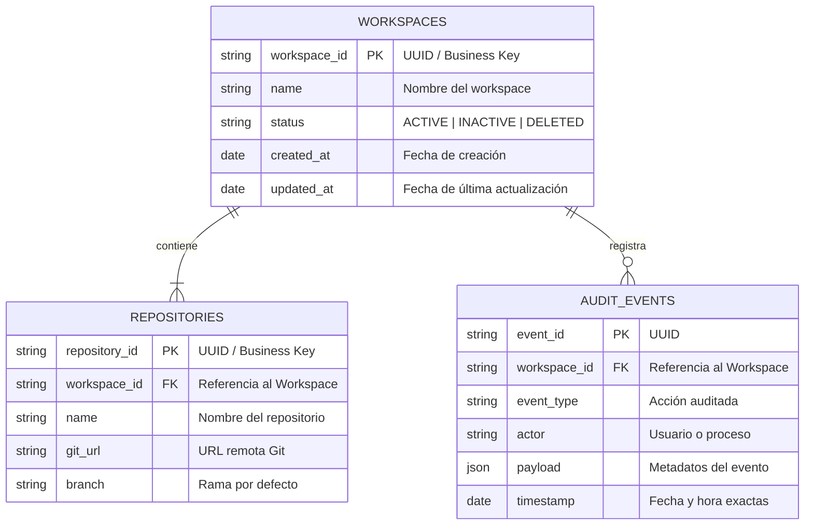

# 📐 Catálogo de Esquema de Base de Datos

**Proyecto**: Devscripts / Enterprise Platform  
**Última Actualización**: 2026-08-07  
**Estado**: 🟢 ACTUALIZADO  

---

## 📑 Tabla de Contenidos

- [Visión General](#-visión-general)
- [Diagrama de Entidades (ER)](#-diagrama-de-entidades-er)
- [Catálogo de Colecciones / Tablas](#-catálogo-de-colecciones--tablas)
  - [Colección / Tabla: `workspaces`](#colección--tabla-workspaces)
  - [Colección / Tabla: `repositories`](#colección--tabla-repositories)
  - [Colección / Tabla: `audit_events`](#colección--tabla-audit_events)
- [Diccionario de Datos](#-diccionario-de-datos)

---

## 🌐 Visión General

El sistema utiliza un enfoque híbrido de persistencia:
- **MongoDB**: Almacenamiento de documentos sin esquema rígido para metadatos de workspaces, estado de herramientas y registros de eventos.
- **PostgreSQL**: Persistencia relacional para datos estructurados de dominio, usuarios, permisos y transacciones de plataforma.

---

## 📊 Diagrama de Entidades (ER)

---

## 📋 Catálogo de Colecciones / Tablas

### Colección / Tabla: `workspaces`

- **Motor**: MongoDB / PostgreSQL  
- **Descripción**: Almacena los entornos de trabajo aislados administrados por la herramienta.  
- **Business Key**: `workspace_id` (UUIDv4)  

#### Diccionario de Campos:

| Campo | Tipo de Dato | Requerido | Default | Descripción / Constraints |
| :--- | :--- | :---: | :--- | :--- |
| `_id` | `ObjectId` / `VARCHAR(36)` | SI | Auto | Identificador primario en BD. |
| `workspace_id` | `STRING` | SI | N/A | Business Key única (UUIDv4). Usado en referencias externas. |
| `name` | `STRING` | SI | N/A | Nombre único del workspace (kebab-case). |
| `path` | `STRING` | SI | N/A | Ruta absoluta en el sistema de archivos local. |
| `status` | `STRING` | SI | `'ACTIVE'` | Enum: `ACTIVE`, `PAUSED`, `ARCHIVED`, `DELETED`. |
| `created_at` | `TIMESTAMP` | SI | `NOW()` | Fecha y hora UTC de creación. |
| `updated_at` | `TIMESTAMP` | SI | `NOW()` | Fecha y hora UTC de última modificación. |

#### Índices:

| Nombre del Índice | Tipo | Campos | Único |
| :--- | :--- | :--- | :---: |
| `idx_workspaces_bid` | B-Tree | `workspace_id` | SI |
| `idx_workspaces_name` | B-Tree | `name` | SI |

---

### Colección / Tabla: `repositories`

- **Motor**: MongoDB / PostgreSQL  
- **Descripción**: Contiene la definición de los repositorios vinculados a cada workspace.  
- **Business Key**: `repository_id` (UUIDv4)  

#### Diccionario de Campos:

| Campo | Tipo de Dato | Requerido | Default | Descripción / Constraints |
| :--- | :--- | :---: | :--- | :--- |
| `_id` | `ObjectId` / `VARCHAR(36)` | SI | Auto | PK de la base de datos. |
| `repository_id` | `STRING` | SI | N/A | Business Key única. |
| `workspace_id` | `STRING` | SI | N/A | FK referenciando `workspaces.workspace_id`. |
| `name` | `STRING` | SI | N/A | Nombre corto del repositorio. |
| `git_url` | `STRING` | SI | N/A | URL SSH o HTTPS del repositorio Git. |
| `default_branch` | `STRING` | SI | `'main'` | Rama principal asignada. |
| `created_at` | `TIMESTAMP` | SI | `NOW()` | Fecha de registro. |

#### Índices:

| Nombre del Índice | Tipo | Campos | Único |
| :--- | :--- | :--- | :---: |
| `idx_repos_ws_id` | B-Tree | `workspace_id` | NO |
| `idx_repos_bid` | B-Tree | `repository_id` | SI |

---

### Colección / Tabla: `audit_events`

- **Motor**: MongoDB  
- **Descripción**: Registro append-only de eventos de auditoría y operaciones ejecutadas sobre los repositorios y workspaces.  
- **Business Key**: `event_id` (UUIDv4)  

#### Diccionario de Campos:

| Campo | Tipo de Dato | Requerido | Default | Descripción / Constraints |
| :--- | :--- | :---: | :--- | :--- |
| `_id` | `ObjectId` | SI | Auto | PK nativa de MongoDB. |
| `event_id` | `STRING` | SI | N/A | UUIDv4 único del evento de auditoría. |
| `workspace_id` | `STRING` | SI | N/A | Referencia de negocio a `workspaces.workspace_id`. |
| `action` | `STRING` | SI | N/A | Nombre de la acción (ej. `WORKSPACE_CREATED`, `REPO_SYNCED`). |
| `actor` | `STRING` | SI | N/A | Identificador del usuario o proceso ejecutor. |
| `metadata` | `DOCUMENT` | NO | `{}` | Payload JSON con información contextual de la operación. |
| `timestamp` | `TIMESTAMP` | SI | `NOW()` | Fecha y hora ISO-8601 del evento. |

#### Índices:

| Nombre del Índice | Tipo | Campos | Único |
| :--- | :--- | :--- | :---: |
| `idx_audit_ws_ts` | Compuesto | `workspace_id`, `timestamp` | NO |
| `idx_audit_event_id` | B-Tree | `event_id` | SI |
