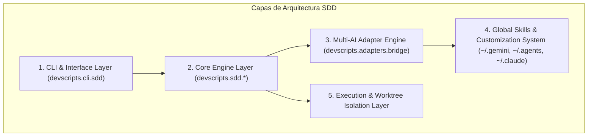
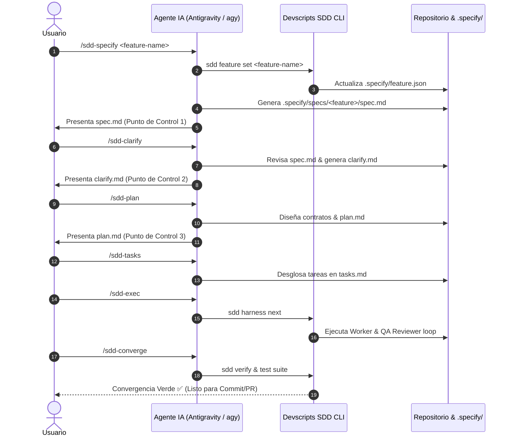
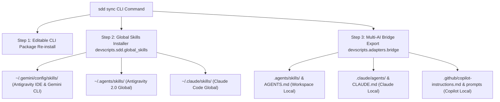

# Arquitectura del Sistema Spec-Driven Development (SDD) y Adaptadores Multi-IA

Este documento define formalmente la **arquitectura técnica, patrones de diseño y decisiones de ingeniería** del motor de Spec-Driven Development (SDD) integrado en `devscripts`.

---

## 🏛️ 1. Visión General y Principios de Diseño (El "Por Qué")

### ¿Por qué Spec-Driven Development (SDD)?
El desarrollo asistido por modelos de lenguaje (LLMs / Agentes de IA) tradicionalmente sufre de **alucinaciones de requerimientos, deriva de alcance (*Scope Drift*) y degradación del contexto de memoria** en proyectos complejos. SDD resuelve estos problemas estructurando el proceso de desarrollo en torno a una **Especificación Formal Ejecutable como Fuente Única de Verdad**.

---

## 🎯 2. Pilares de Ingeniería de SDD

1. **Contratos Primero (Contracts-First)**:
   - *Por qué*: Las interfaces TypeScript, esquemas Zod o DTOs Java se definen antes de cualquier lógica de negocio. Esto elimina la ambigüedad en los bordes del sistema y proporciona validación estática inmediata.
2. **Harnés de Pruebas Primero (Test Harness First)**:
   - *Por qué*: Se escriben pruebas unitarias e integrales que fallan (RED) antes de implementar el código. Garantiza que la especificación sea ejecutable.
3. **Implementación Mínima (YAGNI / Minimal Scope)**:
   - *Por qué*: Los agentes de IA tienden a agregar abstracciones no solicitadas. SDD restringe las mutaciones al código estrictamente necesario para pasar los tests y cumplir el contrato.
4. **Protocolo Híbrido (Determinismo CLI + Inspección Dinámica de IA)**:
   - *Por qué*: Combina la velocidad e idempotencia de scripts ejecutable Python para la estructura base, con la capacidad razonadora de la IA para descubrir linters, convención de commits y patrones de diseño no documentados.

---

## 🔄 3. Diagrama de Secuencia del Ciclo de Vida (8 Fases)

El desarrollo avanza secuencialmente. Cada fase exige un punto de control humano (*Human Gate Checkpoint*) antes de proceder:

---

## 🔀 4. Flujo de Sincronización Multi-IA y Gestión Global de Habilidades (`sdd sync`)

El comando `sdd sync` garantiza que todas las habilidades y reglas del proyecto se distribuyan homogéneamente en el entorno del usuario:

---

## 📁 5. Estructura Persistente de Artefactos `.specify/`

* **`.specify/feature.json`**: Rastreo de estado activo (`active_feature`, `current_phase`, timestamps).
* **`.specify/constitution/`**: Fuente de verdad de la arquitectura del proyecto (`constitution.md`, `memory.md`).
* **`.specify/specs/<feature-name>/`**: Artefactos del ciclo de 8 fases (`spec.md`, `clarify.md`, `plan.md`, `checklist.md`, `tasks.md`).
* **`.specify/history/`**: Registros de auditoría de agentes Worker y QA Reviewer.
* **`.specify/agents.json`**: Registro de adaptadores IA configurados en el proyecto.
