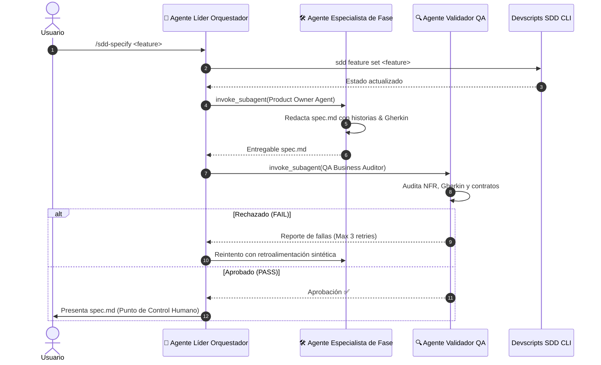
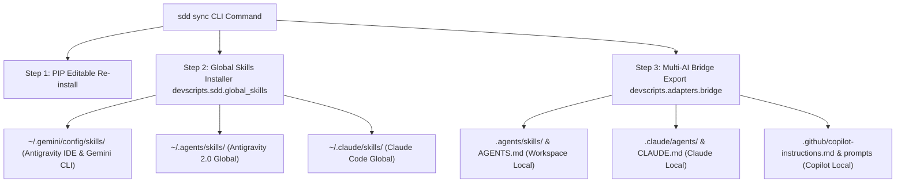

# Arquitectura del Sistema Spec-Driven Development (SDD) y Células Multi-Agente Especializadas

Este documento define la **arquitectura técnica, patrones de diseño y modelo de orquestación multi-agente** del motor de Spec-Driven Development (SDD) en `devscripts`, alineado con la especificación de **GitHub Spec-Kit**.

---

## 🏛️ 1. Visión General y Principios de Diseño (El "Por Qué")

### ¿Por qué Células Multi-Agente Especializadas?
Los desarrollos con un único agente generalista sufren de **pérdida de foco, degradación de contexto y falta de rigor de auditoría**. Siguiendo la filosofía de GitHub Spec-Kit, SDD desacopla la ejecución en **Células Multi-Agente Especializadas por Fase**, donde ningún agente trabaja sin supervisión adversarial de un Validador QA.

```mermaid
graph TD
    subgraph "Capas de la Arquitectura SDD & Multi-Agente"
        CLI["1. CLI & Interface Layer (devscripts.cli.sdd)"]
        LEADER["2. Leader Orchestrator Agent (Context & Flow Controller)"]
        SPECIALIST["3. Specialized Domain Subagent (Product Owner / Architect / Worker)"]
        VALIDATOR["4. QA Reviewer & Security Auditor Agent"]
        ADAPTERS["5. Multi-AI Adapter Engine (devscripts.adapters.bridge)"]
        SKILLS["6. Global Skills System (~/.gemini, ~/.agents, ~/.claude)"]
    end

    CLI --> LEADER
    LEADER -->|invoke_subagent| SPECIALIST
    SPECIALIST -->|Entregable / Artefacto| VALIDATOR
    VALIDATOR -->|Aprobado / Auto-corrección (Max 3)| LEADER
    LEADER --> ADAPTERS
    ADAPTERS --> SKILLS
```

---

## ⚙️ 2. Separación de Responsabilidades: CLI Determinístico vs. Agentes de IA

Una de las decisiones clave de la arquitectura es la estricta división entre el CLI estático y las habilidades inteligentes de IA:

1. **CLI en Consola (`devscripts.cli.sdd`) — Orquestador de Estado Determinístico**:
   - *Rol*: Garantiza la idempotencia del estado (`.specify/feature.json`), crea la estructura de carpetas físicas en disco, registra timestamps, ejecuta tests de forma síncrona y valida precondiciones.
   - *Propiedad*: 100% Python nativo, rápido, sin alucinaciones.

2. **Agente de IA / Habilidades (`/sdd-*`) — Inteligencia Razonadora**:
   - *Rol*: Analiza el dominio del proyecto, redacta las historias de usuario y escenarios Gherkin en `spec.md`, diseña los contratos Zod/DTOs en `plan.md`, implementa el código minimalista en `sdd-exec` y realiza auditorías adversariales.
   - *Interacción*: La habilidad de IA invoca al CLI determinístico para asegurar el registro estático y luego llama a los subagentes especialistas vía `invoke_subagent`.

---

## 👥 3. Células de Subagentes Especialistas por Fase SDD

Cada fase operativa del SDD instancia una tríada de agentes:



---

## 🔀 4. Sincronización Global y Local de Adaptadores (`sdd sync`)

El comando `sdd sync` propaga las 16 habilidades nativas con la arquitectura de subagentes hacia todos los entornos de desarrollo:



---

## 📁 5. Estructura Persistente de Artefactos `.specify/`

* **`.specify/feature.json`**: Registro de seguimiento (`active_feature`, `current_phase`, timestamps).
* **`.specify/constitution/`**: Fuente de verdad de la arquitectura (`constitution.md`, `memory.md`).
* **`.specify/specs/<feature-name>/`**: Artefactos del ciclo (`spec.md`, `clarify.md`, `plan.md`, `checklist.md`, `tasks.md`).
* **`.specify/history/`**: Registros de auditoría de agentes Worker y QA Reviewer.
* **`.specify/tech-debt.md`**: Catálogo de deuda técnica con bloques de remediación copy-paste.
