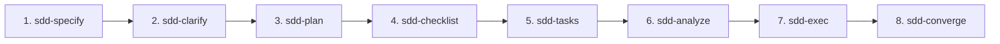

# Manual Funcional y Catálogo de Habilidades SDD (Spec-Driven Development)

Este documento sirve como manual de referencia funcional y operativo para el catálogo de **16 Habilidades SDD** integradas en `devscripts` y compatibles con Antigravity, Gemini CLI, Claude Code y GitHub Copilot.

---

## 🧭 Resumen del Ciclo de Vida SDD (8 Fases)

El flujo de desarrollo guiado por especificaciones (**Spec-Driven Development**) avanza de forma strictly secuencial a través de 8 fases operativas, complementadas por herramientas de inicialización, verificación, arnés y mantenimiento:

---

## ⚙️ Regla de Validación de Parámetros (Paso 0)

Todas las habilidades implementan un **Protocolo de Validación de Precondiciones (Paso 0)** para evitar ejecuciones accidentales con nombres de característica (*feature*) en blanco o valores por defecto "default":

1. **Evaluación de Entrada**: Verifica si se pasó un parámetro explícito en la llamada Slash (ej. `/sdd-specify mi-feature`).
2. **Consulta de Feature Activo**: Si no hay argumento, consulta el registro en `.specify/feature.json` mediante `sdd feature get`.
3. **Manejo de Ausencia de Parámetro**: Si no hay feature activo ni argumento:
   - **No procede** con cadenas vacías ni cae en `"default"`.
   - Interrumpe la ejecución e informa al usuario o solicita el nombre mediante la herramienta `AskUserQuestion`.

---

## 📚 Catálogo Completo de Habilidades SDD

### 1. `/sdd-specify` — Fase 1: Especificación Funcional
* **Comando Slash**: `/sdd-specify <nombre-del-feature>`
* **Propósito**: Generar la especificación funcional inicial (`spec.md`) con historias de usuario, requerimientos funcionales/NFR y escenarios de aceptación Gherkin.
* **Artefacto Generado**: `.specify/specs/<feature-name>/spec.md`
* **Entradas**: Descripción funcional proporcionada por el usuario.

### 2. `/sdd-clarify` — Fase 2: Auditoría de Ambigüedades
* **Comando Slash**: `/sdd-clarify [nombre-del-feature]`
* **Propósito**: Auditar `spec.md` para identificar vacíos de requerimientos, riesgos y supuestos no declarados.
* **Artefacto Generado**: `.specify/specs/<feature-name>/clarify.md`

### 3. `/sdd-plan` — Fase 3: Blueprint Técnico y Contratos
* **Comando Slash**: `/sdd-plan [nombre-del-feature]`
* **Propósito**: Diseñar la arquitectura técnica, definir interfaces TypeScript, esquemas Zod o DTOs Java (Contratos Primero) y diagramas de componentes Mermaid.
* **Artefacto Generado**: `.specify/specs/<feature-name>/plan.md`

### 4. `/sdd-checklist` — Fase 4: Definición de Quality Gates
* **Comando Slash**: `/sdd-checklist [nombre-del-feature]`
* **Propósito**: Establecer los criterios de aceptación no negociables y Definition of Done (DoD) para la característica.
* **Artefacto Generado**: `.specify/specs/<feature-name>/checklist.md`

### 5. `/sdd-tasks` — Fase 5: Desglose de Tareas Ejecutables
* **Comando Slash**: `/sdd-tasks [nombre-del-feature]`
* **Propósito**: Atomizar el plan técnico en tareas ordenadas e independientes listas para ejecución.
* **Artefacto Generado**: `.specify/specs/<feature-name>/tasks.md`

### 6. `/sdd-analyze` — Fase 6: Auditoría Estática Cruzada
* **Comando Slash**: `/sdd-analyze [nombre-del-feature]`
* **Propósito**: Realizar una verificación de consistencia cruzada entre `spec.md`, `clarify.md`, `plan.md`, `checklist.md` y `tasks.md` antes de escribir código.
* **Artefacto Generado**: `.specify/history/analysis-<timestamp>.json`

### 7. `/sdd-exec` — Fase 7: Orquestación Iterativa de Tareas
* **Comando Slash**: `/sdd-exec [nombre-del-feature]`
* **Propósito**: Ejecutar tareas iterativamente utilizando roles de Agente Worker y Agente QA Reviewer en un bucle acotado.
* **Artefactos Mutados**: Código fuente del proyecto y registros en `.specify/history/`.

### 8. `/sdd-converge` — Fase 8: Convergencia Final y Verificación
* **Comando Slash**: `/sdd-converge [nombre-del-feature]`
* **Propósito**: Validar que todos los tests pasen en verde, la checklist esté cumplida y los escenarios Gherkin se satisfagan antes del commit o PR.

---

### 🛠️ Habilidades de Soporte y Orquestación

### 9. `/sdd-init` — Inicialización SDD (Protocolo Híbrido)
* **Comando Slash**: `/sdd-init`
* **Propósito**: Inicializar la estructura `.specify/`, `.agents/`, `.claude/` e inspeccionar dinámicamente el proyecto para poblar la constitución inicial.

### 10. `/sdd-verify` — Suite de Verificación Automática
* **Comando Slash**: `/sdd-verify`
* **Propósito**: Ejecutar linters, tests unitarios, verificaciones GET post-mutación y escaneo de secretos/PII.

### 11. `/sdd-harness` — Arnés Multi-Agente
* **Comando Slash**: `/sdd-harness`
* **Propósito**: Controlar el presupuesto de pasos (*max steps*) y evaluar la deriva de alcance (*Scope Drift*) durante ejecuciones autónomas.

### 12. `/sdd-quick` — Ruta Acelerada para Hotfixes
* **Comando Slash**: `/sdd-quick <descripcion-bug>`
* **Propósito**: Flujo simplificado para correcciones menores de errores o parches urgentes sin requerir el ciclo completo de 8 fases.

### 13. `/sdd-constitution` — Fuente de Verdad Arquitectónica
* **Comando Slash**: `/sdd-constitution`
* **Propósito**: Crear o actualizar la constitución del proyecto en `.specify/constitution/constitution.md`.

### 14. `/sdd-audit` — Auditoría de Deuda Técnica
* **Comando Slash**: `/sdd-audit`
* **Propósito**: Analizar el repositorio en busca de patrones obsoletos y catalogar la deuda técnica en `.specify/tech-debt.md`.

### 15. `/sdd-doc` — Motor Autónomo de Documentación
* **Comando Slash**: `/sdd-doc [--full] [--fix]`
* **Propósito**: Escanear la base de código, purgar información sensible y actualizar los READMEs y guías del proyecto.

### 16. `/sdd-remove` — Revocación y Respaldos SDD
* **Comando Slash**: `/sdd-remove [--force]`
* **Propósito**: Generar un respaldo `.specify-backup-<timestamp>` y remover limpiamente la configuración SDD del repositorio.
