# Manual Funcional y Catálogo de Habilidades SDD (Spec-Driven Development)

Este documento sirve como manual de referencia funcional y operativo para el catálogo de **16 Habilidades SDD** integradas en `devscripts` y compatibles con Antigravity, Gemini CLI, Claude Code y GitHub Copilot.

---

## 🧭 Resumen del Ciclo de Vida SDD Multi-Agente (8 Fases)

El flujo de desarrollo guiado por especificaciones (**Spec-Driven Development**) avanza de forma estrictamente secuencial a través de 8 fases operativas. Cada fase opera bajo una **Célula Multi-Agente Especializada** (Líder Orquestador + Agente Especialista + Agente Validador QA):

```mermaid
graph LR
    F1["1. sdd-specify\n(PO Agent + QA)"] --> F2["2. sdd-clarify\n(Risk Specialist + QA)"]
    F2 --> F3["3. sdd-plan\n(Architect Agent + QA)"]
    F3 --> F4["4. sdd-checklist\n(DoD Specialist + QA)"]
    F4 --> F5["5. sdd-tasks\n(Planner Agent + QA)"]
    F5 --> F6["6. sdd-analyze\n(Consistency Auditor + QA)"]
    F6 --> F7["7. sdd-exec\n(Worker Agent + QA)"]
    F7 --> F8["8. sdd-converge\n(Release Manager + QA)"]
```



---

## ⚙️ Regla de Validación de Parámetros (Paso 0)

Todas las habilidades implementan un **Protocolo de Validación de Precondiciones (Paso 0)** para evitar ejecuciones accidentales con nombres de característica (*feature*) en blanco o valores por defecto "default":

1. **Evaluación de Entrada**: Verifica si se pasó un parámetro explícito en la llamada Slash (ej. `/sdd-specify mi-feature`).
2. **Consulta de Feature Activo**: Si no hay argumento, consulta el registro en `.specify/feature.json` mediante `sdd feature get`.
3. **Manejo de Ausencia de Parámetro**: Si no hay feature activo ni argumento:
   - **No procede** con cadenas vacías ni cae en `"default"`.
   - Interrumpe la ejecución e informa al usuario o solicita el nombre mediante la herramienta `AskUserQuestion`.

---

## 👥 Matriz de Subagentes Especialistas por Fase

| Fase SDD | Agente Especialista (`invoke_subagent`) | Agente Validador QA (`invoke_subagent`) | Entregable Principal |
| :--- | :--- | :--- | :--- |
| **1. sdd-specify** | `Product Owner Agent` | `QA Business Auditor` | `.specify/specs/<feature>/spec.md` |
| **2. sdd-clarify** | `Ambiguity Resolution Specialist` | `Risk Audit QA Agent` | `.specify/specs/<feature>/clarify.md` |
| **3. sdd-plan** | `Software Architect Agent` | `Contract Validator QA` | `.specify/specs/<feature>/plan.md` |
| **4. sdd-checklist** | `Quality Gate Specialist` | `DoD Compliance QA` | `.specify/specs/<feature>/checklist.md` |
| **5. sdd-tasks** | `Lead Tech Planner Agent` | `Task Atomization QA` | `.specify/specs/<feature>/tasks.md` |
| **6. sdd-analyze** | `Static Consistency Auditor` | `Cross-Artifact QA Agent` | `.specify/history/analysis-*.json` |
| **7. sdd-exec** | `Worker Implementation Agent` | `QA Code Reviewer Agent` | Código fuente & `.specify/history/` |
| **8. sdd-converge**| `Release Manager Agent` | `Gherkin Verification QA` | PR en GitHub & `.specify/feature.json` |

---

## 📚 Catálogo Completo de Habilidades SDD

### 1. `/sdd-specify` — Fase 1: Especificación Funcional
* **Comando Slash**: `/sdd-specify <nombre-del-feature>`
* **Célula Multi-Agente**: Orquestador ➔ `Product Owner Agent` ➔ `QA Business Auditor`.
* **Propósito**: Generar la especificación funcional inicial (`spec.md`) con historias de usuario, requerimientos funcionales/NFR y escenarios de aceptación Gherkin.
* **Artefacto Generado**: `.specify/specs/<feature-name>/spec.md`

### 2. `/sdd-clarify` — Fase 2: Auditoría de Ambigüedades
* **Comando Slash**: `/sdd-clarify [nombre-del-feature]`
* **Célula Multi-Agente**: Orquestador ➔ `Ambiguity Resolution Specialist` ➔ `Risk Audit QA Agent`.
* **Propósito**: Auditar `spec.md` para identificar vacíos de requerimientos, riesgos y supuestos no declarados.
* **Artefacto Generado**: `.specify/specs/<feature-name>/clarify.md`

### 3. `/sdd-plan` — Fase 3: Blueprint Técnico y Contratos
* **Comando Slash**: `/sdd-plan [nombre-del-feature]`
* **Célula Multi-Agente**: Orquestador ➔ `Software Architect Agent` ➔ `Contract Validator QA`.
* **Propósito**: Diseñar la arquitectura técnica, definir interfaces TypeScript, esquemas Zod o DTOs Java (Contratos Primero) y diagramas de componentes Mermaid.
* **Artefacto Generado**: `.specify/specs/<feature-name>/plan.md`

### 4. `/sdd-checklist` — Fase 4: Definición de Quality Gates
* **Comando Slash**: `/sdd-checklist [nombre-del-feature]`
* **Célula Multi-Agente**: Orquestador ➔ `Quality Gate Specialist` ➔ `DoD Compliance QA`.
* **Propósito**: Establecer los criterios de aceptación no negociables y Definition of Done (DoD) para la característica.
* **Artefacto Generado**: `.specify/specs/<feature-name>/checklist.md`

### 5. `/sdd-tasks` — Fase 5: Desglose de Tareas Ejecutables
* **Comando Slash**: `/sdd-tasks [nombre-del-feature]`
* **Célula Multi-Agente**: Orquestador ➔ `Lead Tech Planner Agent` ➔ `Task Atomization QA`.
* **Propósito**: Atomizar el plan técnico en tareas ordenadas e independientes listas para ejecución.
* **Artefacto Generado**: `.specify/specs/<feature-name>/tasks.md`

### 6. `/sdd-analyze` — Fase 6: Auditoría Estática Cruzada
* **Comando Slash**: `/sdd-analyze [nombre-del-feature]`
* **Célula Multi-Agente**: Orquestador ➔ `Static Consistency Auditor` ➔ `Cross-Artifact QA Agent`.
* **Propósito**: Realizar una verificación de consistencia cruzada entre `spec.md`, `clarify.md`, `plan.md`, `checklist.md` y `tasks.md` antes de escribir código.

### 7. `/sdd-exec` — Fase 7: Orquestación Iterativa de Tareas
* **Comando Slash**: `/sdd-exec [nombre-del-feature]`
* **Célula Multi-Agente**: Orquestador ➔ `Worker Implementation Agent` ➔ `QA Code Reviewer Agent`.
* **Propósito**: Ejecutar tareas iterativamente en hilos paralelos acotados con auto-corrección de hasta 3 reintentos.

### 8. `/sdd-converge` — Fase 8: Convergencia Final, PR y Cleanup
* **Comando Slash**: `/sdd-converge [nombre-del-feature]`
* **Célula Multi-Agente**: Orquestador ➔ `Release Manager Agent` ➔ `Gherkin Verification QA`.
* **Propósito**: Validar suite de pruebas, empaquetar cambios, hacer `git push`, crear el PR en GitHub vía `gh`, borrar el Worktree local y hacer `git pull origin main`.

---

### 🛠️ Habilidades de Soporte y Remediación

### 14. `/sdd-audit` — Auditoría de Deuda Técnica y Remediación Copy-Paste
* **Comando Slash**: `/sdd-audit`
* **Propósito**: Analizar el repositorio en busca de patrones obsoletos y catalogar la deuda técnica en `.specify/tech-debt.md`.
* **Bloque Copy-Paste Integrado**: En cada hallazgo 🔴 CRÍTICO y 🟠 ALTO genera el bloque exacto de comando para copiar y pegar:
  ```markdown
  > 📋 **Comando de Remediación SDD (Copiar y Pegar)**:
  > ```bash
  > /sdd-quick "Resolver [TD-001]: Corregir credencial expuesta en backend/auth.py"
  > ```
  ```
