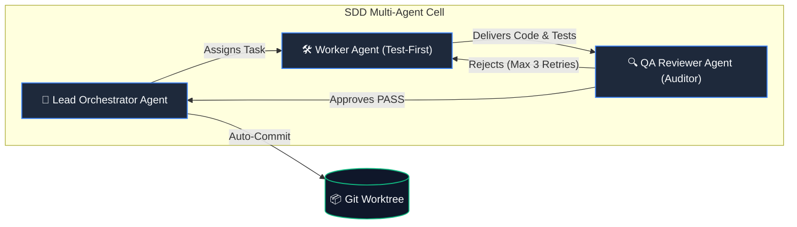

# Spec-Driven Development (SDD) Architecture & Multi-Agent Cells

This document details the multi-agent cell architecture, execution invariants, MCP integration, and self-healing test harness of the **Cucco SpecOps Engine**.

---

## 🏛️ 1. Specialized Multi-Agent Cell

Rather than relying on a single generalist agent prone to context drift and hallucination, SDD organizes work into specialized adversarial cells:

---

## ⚙️ 2. Determinism vs. AI Intelligence

1. **Deterministic Tools (`workspace_engine` & `sdd_engine.harness.verify`)**:
   - Native builds (`ws build`), JDK management (`ws java`), dependency installation, linter validation, and test execution.
   - Millisecond execution, zero hallucination, massive token savings.
2. **Intelligent AI Agents (`packages/sdd/skills/`)**:
   - Domain reasoning, formal schema design, Gherkin drafting, and business logic implementation backed by deterministic tools.

---

## 🔌 3. FastMCP Server & Dynamic Context Matcher

- **FastMCP Server (`sdd mcp`)**: Exposes deterministic tools (`sdd_verify`, `ws_clean`, `sdd_get_rules`, `sdd_feature_status`) over JSON-RPC 2.0 stdio for Claude Code, Cursor, and VS Code.
- **Dynamic Context Matcher (`sdd match-rules`)**: Analyzes git diffs and injects only relevant scoped rules, reducing token consumption by 40% to 75%.
