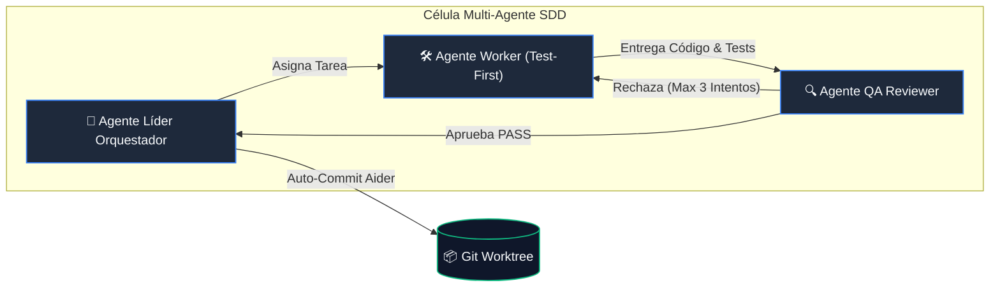

# Arquitectura de Spec-Driven Development (SDD) & Células Multi-Agente

Este documento describe los principios arquitectónicos, modelos de invariantes e integración multi-agente del motor de SDD en `devscripts`.

---

## 🏛️ 1. Células Multi-Agente Especializadas por Fase

En lugar de un único agente generalista con amnesia o pérdida de foco, SDD implementa células especializadas donde ningún agente trabaja sin supervisión adversarial:

---

## ⚙️ 2. División Estricta: Determinismo vs. Inteligencia Artificial

1. **Herramientas Deterministas en Python (`workspace_engine` & `sdd_engine.harness.verify`)**:
   - Compilación nativa (`build-project`), setup de JDK (`set-java`), instalación de dependencias (`install-deps`), verificación de linters y ejecución de tests.
   - Cero alucinaciones, ejecución síncrona en milisegundos y ahorro masivo de tokens.
2. **Agentes Inteligentes de IA (`packages/sdd/skills/`)**:
   - Razonan sobre el dominio, diseñan contratos, redactan especificaciones y resuelven la lógica de negocio apoyándose en las herramientas deterministas.

---

## 🛡️ 3. Intercepción y Hooks de Seguridad

- **Pre-Tool Hooks (`sdd hook pre-tool`)**: Bloquea la ejecución de comandos destructivos (`rm -rf /`), piping remoto (`curl ... | sh`), fork bombs y mutaciones de BD no autorizadas.
- **Post-Tool Hooks (`sdd hook post-tool`)**: Ejecuta verificaciones estáticas inmediatas (linters, escaneo de secretos y lecturas GET post-mutación) tras cada edición de archivo.
