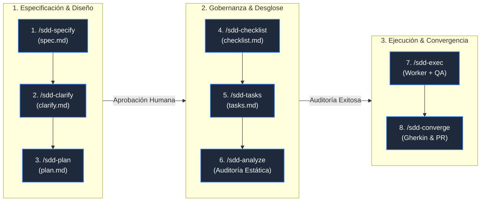

# Ciclo de Vida de Spec-Driven Development (SDD) — Paso a Paso

El desarrollo guiado por especificaciones (**Spec-Driven Development o SDD**) es una metodología rigurosa que antepone la definición formal de interfaces y contratos antes de la implementación de lógica de negocio, reduciendo drásticamente los errores en fases tardías y garantizando la convergencia del código generado por agentes de IA.

---

## 🔄 El Ciclo de Vida Estricto de 8 Fases

Todo desarrollo de características avanza de forma estrictamente secuencial a través de 3 bloques metodológicos:

---

## 📑 Detalle de Cada Fase y Artefactos Generados

### 1. `/sdd-specify` ➔ Especificación Funcional (`spec.md`)
- **Propósito**: Definir las historias de usuario, escenarios en formato Gherkin (`Given-When-Then`) y requerimientos no funcionales (NFRs).
- **Artefacto**: `.specify/specs/<feature>/spec.md`.
- **Habilidad**: [`packages/sdd/skills/sdd-specify/`](file://~/projects/devscripts/packages/sdd/skills/sdd-specify/SKILL.md).

### 2. `/sdd-clarify` ➔ Resolución de Ambigüedades (`clarify.md`)
- **Propósito**: Identificar riesgos técnicos, casos de borde, dependencias críticas y resolver dudas mediante preguntas estructuradas al desarrollador.
- **Artefacto**: `.specify/specs/<feature>/clarify.md`.
- **Habilidad**: [`packages/sdd/skills/sdd-clarify/`](file://~/projects/devscripts/packages/sdd/skills/sdd-clarify/SKILL.md).

### 3. `/sdd-plan` ➔ Blueprint Técnico y Contratos (`plan.md`)
- **Propósito**: Diseñar la arquitectura técnica, definir interfaces TypeScript, esquemas Zod o DTOs Java, diagramas de secuencia y endpoints de API.
- **Artefacto**: `.specify/specs/<feature>/plan.md`.
- **Habilidad**: [`packages/sdd/skills/sdd-plan/`](file://~/projects/devscripts/packages/sdd/skills/sdd-plan/SKILL.md).

### 4. `/sdd-checklist` ➔ Quality Gates y Definition of Done (`checklist.md`)
- **Propósito**: Establecer los criterios de aceptación técnicos (cobertura JaCoCo $\ge$ 90%, linter estático, confirmaciones GET, seguridad).
- **Artefacto**: `.specify/specs/<feature>/checklist.md`.
- **Habilidad**: [`packages/sdd/skills/sdd-checklist/`](file://~/projects/devscripts/packages/sdd/skills/sdd-checklist/SKILL.md).

### 5. `/sdd-tasks` ➔ Desglose de Tareas Ejecutables (`tasks.md`)
- **Propósito**: Crear una lista atomizada y secuencial de tareas de código mínimas (`- [ ] T1: ...`, `- [ ] T2: ...`) que los agentes puedan ejecutar de forma aislada.
- **Artefacto**: `.specify/specs/<feature>/tasks.md`.
- **Habilidad**: [`packages/sdd/skills/sdd-tasks/`](file://~/projects/devscripts/packages/sdd/skills/sdd-tasks/SKILL.md).

### 6. `/sdd-analyze` ➔ Auditoría Estática Cruzada
- **Propósito**: Verificar la consistencia interna entre `spec.md`, `clarify.md`, `plan.md`, `checklist.md` y `tasks.md` antes de escribir una sola línea de código productivo.
- **Habilidad**: [`packages/sdd/skills/sdd-analyze/`](file://~/projects/devscripts/packages/sdd/skills/sdd-analyze/SKILL.md).

### 7. `/sdd-exec` ➔ Ejecución Iterativa (Worker + QA Reviewer)
- **Propósito**: El **Worker Agent** implementa la tarea siguiendo Test-First; el **QA Reviewer Agent** audita el código adversarialmente. Al aprobarse, se realiza un git commit automático estilo Aider (`sdd(task): complete T1 - desc`).
- **Habilidad**: [`packages/sdd/skills/sdd-exec/`](file://~/projects/devscripts/packages/sdd/skills/sdd-exec/SKILL.md).

### 8. `/sdd-converge` ➔ Verificación Final de Convergencia
- **Propósito**: Comprobación integral de todos los escenarios Gherkin, validación del checklist de calidad y preparación de la rama para Pull Request.
- **Habilidad**: [`packages/sdd/skills/sdd-converge/`](file://~/projects/devscripts/packages/sdd/skills/sdd-converge/SKILL.md).

---

## ⚡ Vía Rápida: `sdd quick`
Para correcciones de bugs menores o parches rápidos donde no se requiera la ceremonia completa de 8 fases, se utiliza **`/sdd-quick`**, el cual genera una micro-especificación, ejecuta la tarea y valida los tests en un único paso atómico.
- **Habilidad**: [`packages/sdd/skills/sdd-quick/`](file://~/projects/devscripts/packages/sdd/skills/sdd-quick/SKILL.md).
