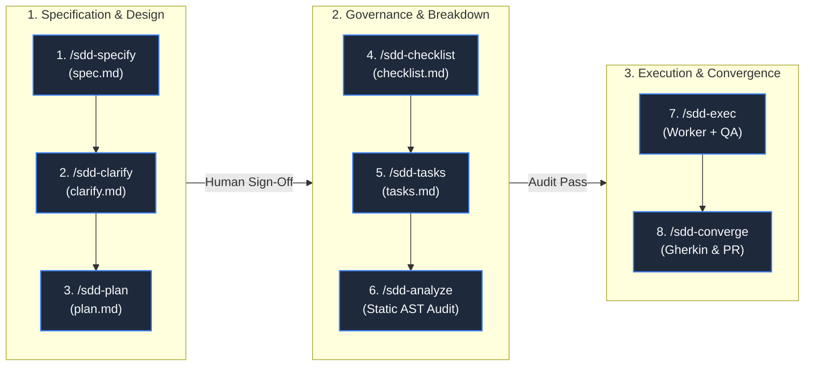

# Spec-Driven Development (SDD) Lifecycle — Step-by-Step Guide

Spec-Driven Development (SDD) is a rigorous engineering methodology that prioritizes formal interface definitions and contracts before business logic implementation, dramatically reducing downstream bugs and ensuring reliable AI-generated code.

---

## 🔄 The Strict 8-Phase Lifecycle

Feature development progresses sequentially through 3 distinct stages:

---

## 📑 Phase Details & Generated Artifacts

### 1. `/sdd-specify` ➔ Functional Specification (`spec.md`)
- User stories, Gherkin acceptance scenarios (`Given-When-Then`), and NFRs.
- Artifact: `.specify/specs/<feature>/spec.md`.

### 2. `/sdd-clarify` ➔ Ambiguity Resolution (`clarify.md`)
- Identifies technical risks, boundary conditions, and logs decisions under `[Q-001]` format.
- Artifact: `.specify/specs/<feature>/clarify.md`.

### 3. `/sdd-plan` ➔ Technical Blueprint & Contracts (`plan.md`)
- TypeScript Zod schemas, Java Records/DTOs, API endpoint contracts, and component diagrams.
- Artifact: `.specify/specs/<feature>/plan.md`.

### 4. `/sdd-checklist` ➔ Quality Gates & DoD (`checklist.md`)
- Quality gates, code coverage thresholds (JaCoCo $\\ge 90\\%$), linters, and DoD items.
- Artifact: `.specify/specs/<feature>/checklist.md`.

### 5. `/sdd-tasks` ➔ Executable Task Breakdown (`tasks.md`)
- Atomic tasks ordered across the 4 SDD Pillars.
- Artifact: `.specify/specs/<feature>/tasks.md`.

### 6. `/sdd-analyze` ➔ Static Cross-Artifact & AST Audit
- Validates internal consistency across artifacts and confirms AST contracts in source code.

### 7. `/sdd-exec` ➔ Iterative Multi-Agent Execution
- Worker Agent implements tasks Test-First (Red -> Green); QA Reviewer Agent adversarially validates diffs. Auto-commits with Conventional Commits.

### 8. `/sdd-converge` ➔ Final Convergence & PR
- Runs complete regression suites, validates all Gherkin scenarios, and creates PR with `sdd finish`.

---

## ⚡ Fast-Path: `sdd quick`
For minor bug fixes and hotfixes, `/sdd-quick` creates a micro-spec, executes the fix, and runs tests in a single atomic step.
