# Manual Funcional y Catálogo de Habilidades SDD (Spec-Driven Development)

Este documento sirve como manual de referencia funcional y operativo para el catálogo de **16 Habilidades SDD** integradas en `devscripts` y compatibles con Antigravity 2.0, Gemini CLI, Claude Code y GitHub Copilot.

---

## 🧭 Resumen del Ciclo de Vida SDD Multi-Agente (8 Fases)

El flujo de desarrollo guiado por especificaciones (**Spec-Driven Development**) avanza de forma estrictamente secuencial a través de 8 fases operativas. Cada fase opera bajo una **Célula Multi-Agente Especializada** (Líder Orquestador + Agente Especialista + Agente Validador QA):

```mermaid
graph LR
    F1["1. sdd-specify\n(PO Agent + QA)"] --> F2["2. sdd-clarify\n(Risk Specialist + QA)"]
    F2 --> F3["3. sdd-plan\n(Architect Agent + QA)"]
    F3 --> F4["4. sdd-checklist\n(DoD Specialist + QA)"]
    F4 --> F5["5. sdd-tasks\n(Planner Agent + QA)"]
    F5 --> F6["6. sdd-analyze\n(Consistency Auditor + QA)"]
    F6 --> F7["7. sdd-exec\n(Worker Agent + QA)"]
    F7 --> F8["8. sdd-converge\n(Release Manager + QA)"]
```

---

## 👥 Matriz de Subagentes Especialistas por Fase

| Fase SDD | Agente Especialista (`invoke_subagent`) | Agente Validador QA (`invoke_subagent`) | Entregable Principal |
| :--- | :--- | :--- | :--- |
| **1. sdd-specify** | `Product Owner Agent` | `QA Business Auditor` | `.specify/specs/<feature>/spec.md` |
| **2. sdd-clarify** | `Ambiguity Resolution Specialist` | `Risk Audit QA Agent` | `.specify/specs/<feature>/clarify.md` |
| **3. sdd-plan** | `Software Architect Agent` | `Contract Validator QA` | `.specify/specs/<feature>/plan.md` |
| **4. sdd-checklist** | `Quality Gate Specialist` | `DoD Compliance QA` | `.specify/specs/<feature>/checklist.md` |
| **5. sdd-tasks** | `Lead Tech Planner Agent` | `Task Atomization QA` | `.specify/specs/<feature>/tasks.md` |
| **6. sdd-analyze** | `Static Consistency Auditor` | `Cross-Artifact QA Agent` | `.specify/history/analysis-*.json` |
| **7. sdd-exec** | `Worker Implementation Agent` | `QA Code Reviewer Agent` | Código fuente & `.specify/history/` |
| **8. sdd-converge**| `Release Manager Agent` | `Gherkin Verification QA` | PR en GitHub & `.specify/feature.json` |

---

## 📚 Catálogo Completo de Habilidades SDD

1. `/sdd-specify`: Fase 1 - Especificación Funcional (`spec.md`).
2. `/sdd-clarify`: Fase 2 - Auditoría de Ambigüedades y Riesgos (`clarify.md`).
3. `/sdd-plan`: Fase 3 - Blueprint Técnico y Contratos (`plan.md`).
4. `/sdd-checklist`: Fase 4 - Definición de Quality Gates y DoD (`checklist.md`).
5. `/sdd-tasks`: Fase 5 - Desglose Atomizado de Tareas (`tasks.md`).
6. `/sdd-analyze`: Fase 6 - Auditoría Estática Cruzada entre Artefactos.
7. `/sdd-exec`: Fase 7 - Orquestación Iterativa (Worker + QA Reviewer).
8. `/sdd-converge`: Fase 8 - Verificación Verde, PR y Cleanup.
9. `/sdd-init`: Inicialización con Protocolo Híbrido (CLI + IA).
10. `/sdd-verify`: Verificación Automatizada (Linters, Tests, GET Post-Mutación).
11. `/sdd-harness`: Control de Presupuesto y Deriva de Alcance.
12. `/sdd-quick`: Ruta Acelerada para Hotfixes o Correcciones de Bugs.
13. `/sdd-constitution`: Reglas y Principios Arquitectónicos.
14. `/sdd-audit`: Auditoría de Deuda Técnica y Remediación.
15. `/sdd-doc`: Motor Autónomo de Documentación y Sanitización.
16. `/sdd-remove`: Remoción Limpia con Respaldo de Adaptadores SDD.
