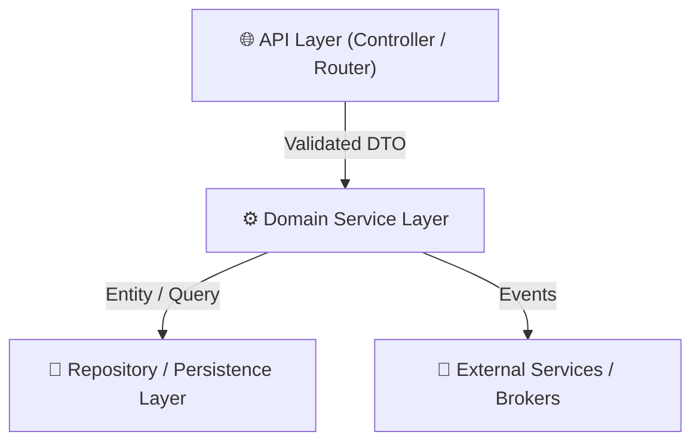

# Technical Blueprint & Data Contracts (`plan.md`)

**Feature**: {feature_name}  
**Author**: Software Architect Agent  
**Date**: {date}

---

## 🏛️ 1. Architecture Overview & Component Diagram



---

## 📋 2. Formal Data Contracts & Interface Schemas

### TypeScript / Zod Schema:
```typescript
import { z } from "zod";

export const ExampleRequestSchema = z.object({
  id: z.string().uuid(),
  name: z.string().min(1).max(100),
  enabled: z.boolean().default(true),
});

export type ExampleRequest = z.infer<typeof ExampleRequestSchema>;
```

### Java Record / DTO:
```java
public record ExampleRequestDto(
    @NotBlank String name,
    @NotNull Boolean enabled
) {}
```

---

## 📡 3. Endpoints & API Specifications
| Method | Route | Request Body | Response Body | Status Codes |
| :--- | :--- | :--- | :--- | :--- |
| `POST` | `/api/v1/example` | `ExampleRequestDto` | `ExampleResponseDto` | `201`, `400`, `409` |
| `GET` | `/api/v1/example/{id}` | None | `ExampleResponseDto` | `200`, `404` |
