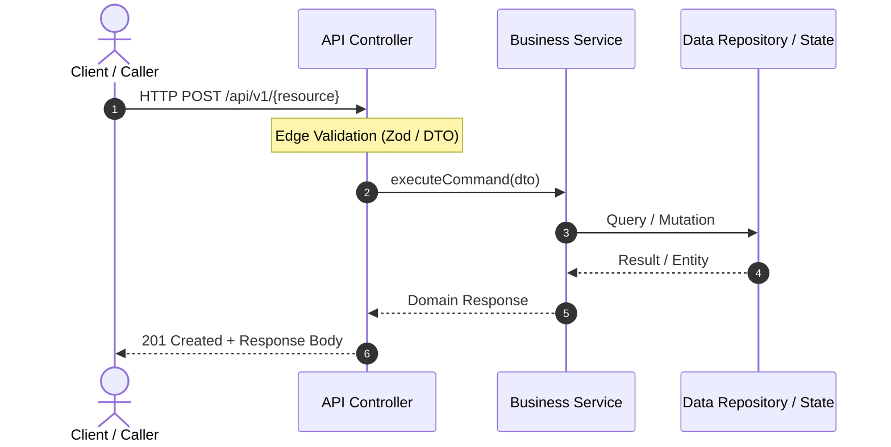

# Technical Plan & Architecture Blueprint: {Feature Title}

**Feature ID**: `{feature-name}`  
**Spec Reference**: [spec.md](./spec.md) | **Clarification**: [clarify.md](./clarify.md)  
**Status**: 🟡 PROPOSED  

---

## 1. Architectural Strategy & Layer Impact
{Detailed summary of modules, packages, and layers affected (API Controller, Service, Domain, Persistence).}

## 2. Sequence Diagram & Data Flow (Mermaid)



## 3. Data Contracts & Formal Interfaces (Contracts First - SDD Pillar 1)
Define schemas and interfaces prior to implementation:

```typescript
// Contract definition (TypeScript / Zod / DTO)
export const FeatureSchema = z.object({
  id: z.string().uuid(),
  name: z.string().min(1).max(100),
});

export type FeatureDTO = z.infer<typeof FeatureSchema>;
```

## 4. Database Migrations & Persistence Strategy
- **ORM / Driver**: {Spring Data, Mongoose, Prisma, Flyway, etc.}
- **Backup Rule Compliance**: Export pre-mutation JSON backup prior to schema mutation if modifying MongoDB.

## 5. Risk & Impact Matrix
| Layer | Change Description | Risk Level | Mitigation Strategy |
|-------|--------------------|------------|---------------------|
| API | New endpoint | Low | API Versioning |
| DB | New table / collection | Medium | Automated migration & backup |
